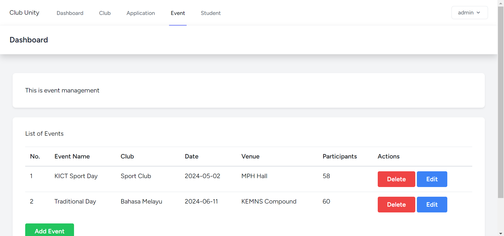
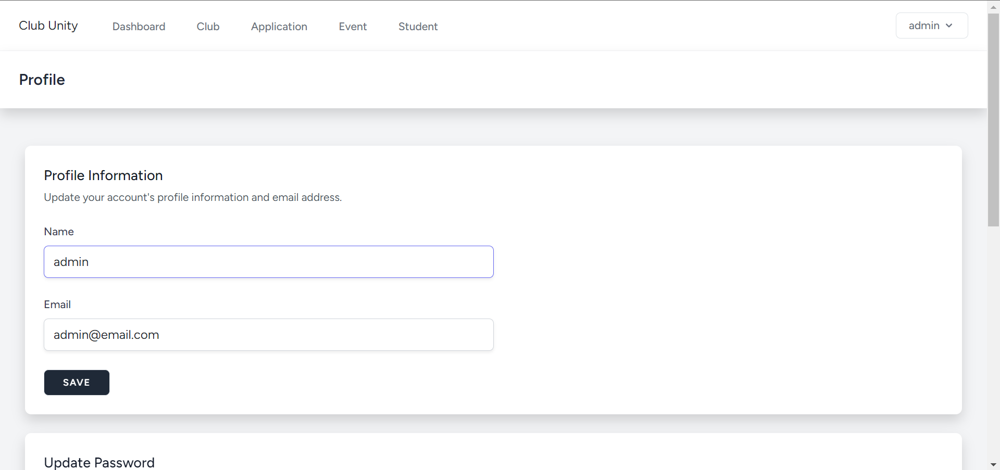

# Project Proposal

# Club Unity: A Comprehensive Web Application for University Club Management

## Group Members:
| Name  | Matric No |
| ------------- | ------------- |
| MUHAMMAD ADIB BIN MOHAMAD TAZMI | 2216265 |
| MUHAMMAD AMIR SYAHMI BIN ROHMAT ROSE | 2215955 |
| MUHAMMAD IRFAN BIN FAIRUZ AZIM | 2211915 |
| SOHAN MOHAMMED ISMAIL CHOWDHURY | 2115849 |

## Introduction:
University clubs and activities may be better managed with the help of Club Unitt, an advanced online tool. Club Unity's powerful features and user-friendly interface are designed to help students, club administrators, and university stakeholders communicate, coordinate, and organise more easily.

## Objective:
Club Unity's main goal is to offer a centralised platform administrator to organising events, maintaining memberships, creating clubs, and processing applications, among other areas of university club operations. Campus Connect seeks to enhance efficiency, transparency, and involvement within the university community by digitising and automating key operations.

## Features and Functionalities:

### Admin-Side:
1. **Home Page:**
   - Display summary of club list and system information.
2. **Club Management (Module):**
   - Add, edit, and delete clubs.
   - View detailed information about each club.
3. **Student Management (Module):**
   - Add, edit, and delete user.
   - View detailed information about each user.
4. **Application Management (Module):**
   - View all applications submitted across all clubs.
   - Add, edit, and delete applications submitted by students.
   - View detailed information about each application.
6. **Event/Programme Management (Module):**
   - Add, edit, and delete events or programs organized by clubs.
   - View detailed information about each event or program.
7. **Update System Information:**
   - Allow administrators to update system-wide information or announcements.
8. **Update Account Details/Credentials:**
   - Allow administrators to update their account details or credentials.
9. **Login and Logout:**
   - Secure login/logout functionality for administrators.

## Sequence Diagram:

## Screen:

### Login:

### Register:

### Admin Dashboard:

### Club Management:

### Application Management:

### Event Management:

### Student Management:

### Profile:

## Challenge to develop this system: