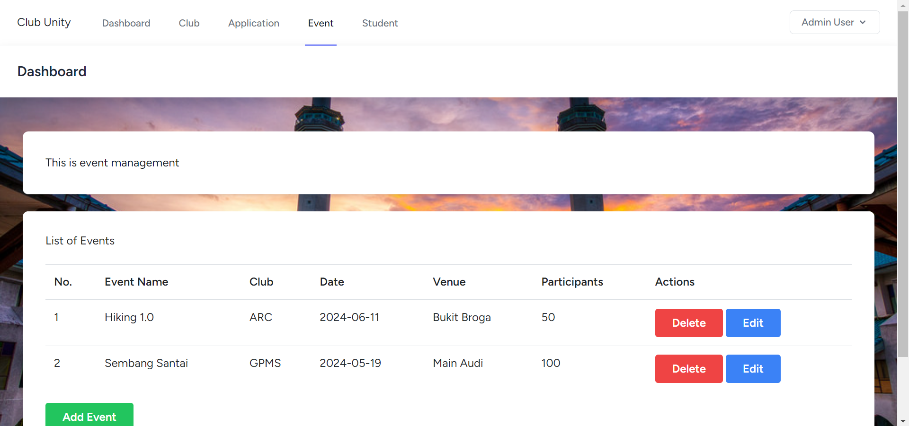

# Final Project

# Club Unity: A Comprehensive Web Application for University Club Management

## Group Members:
| Name  | Matric No |
| ------------- | ------------- |
| MUHAMMAD ADIB BIN MOHAMAD TAZMI | 2216265 |
| MUHAMMAD AMIR SYAHMI BIN ROHMAT ROSE | 2215955 |
| MUHAMMAD IRFAN BIN FAIRUZ AZIM | 2211915 |
| SOHAN MOHAMMED ISMAIL CHOWDHURY | 2115849 |

## Introduction:
University clubs and activities may be better managed with the help of Club Unity, an advanced online tool. Club Unity's powerful features and user-friendly interface are designed to help students, club administrators, and university stakeholders communicate, coordinate, and organise more easily.

## Objective:
Club Unity's main goal is to offer a centralised platform administrator to organising events, maintaining memberships, creating clubs, and processing applications, among other areas of university club operations. Campus Connect seeks to enhance efficiency, transparency, and involvement within the university community by digitising and automating key operations.

## Features and Functionalities:

### Admin-Side:
1. **Dasboard:**
   - Display summary of club list and system information.
2. **Club Management (Module):**
   - Add, edit, and delete clubs.
   - View detailed information about each club.
3. **Student Management (Module):**
   - Add, edit, and delete student.
   - View detailed information about each student.
4. **Application Management (Module):**
   - View all applications submitted across all clubs.
   - Add, edit, and delete applications submitted by students.
   - View detailed information about each application.
6. **Event/Programme Management (Module):**
   - Add, edit, and delete events or programs organized by clubs.
   - View detailed information about each event or program.
7. **Update Account Details/Credentials:**
   - Allow administrators to update their account details or credentials.
8. **Login and Logout:**
   - Secure login/logout functionality for administrators.

## Sequence Diagram:

## Screen:

### Welcome:

### Login:

### Register:

### Admin Dashboard:

### Club Management:

Admin can do CRUD operation which is admin can create, edit, delete the club.

### Application Management:

Admin can do CRUD operation which is admin can create, edit, delete the application.

### Event Management:

Admin can do CRUD operation which is admin can create, edit, delete the event.

### Student Management:

Admin can do CRUD operation which is admin can create, edit, delete the student.

### Profile:

## Challenge to develop this system:
1. **User Authentication and Authorization:** Implementing secure user authentication and authorization mechanisms to ensure that only authorized users can access the system's functionalities.
2. **Data Management:** Designing a robust database schema to manage various types of data efficiently, while ensuring data integrity and consistency.
3. **User Interface Design:** Creating a user-friendly and intuitive interface for administrators to manage clubs, applications, events, and students.
4. **System Scalability:** Building a scalable system architecture that can handle a growing number of users, clubs, and events without compromising performance.
5. **Application Logic:** Implementing complex business logic to support various functionalities such as club registration, event management, application processing, and user profile management.
6. **Security Considerations:** Addressing security vulnerabilities such as SQL injection, cross-site scripting (XSS), and cross-site request forgery (CSRF) to protect the system and its users from malicious attacks.